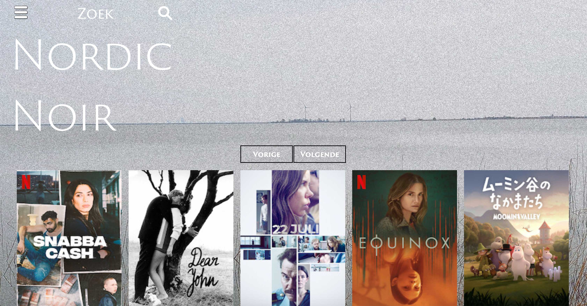

# Eindopdracht Frontend Nordic Noir
## Shaun Sutton

## Inleiding
Nordic Noir is een app voor liefhebbers van Scandinavische films en tv-series. Streamingdienst
Netflix heeft een groot en divers aanbod Scandinavische films en tv-series. Helaas is het binnen
Netflix niet mogelijk om specifiek op Scandinavische producties te selecteren. Abonnees hebben
daardoor geen overzicht van het aanbod. De app Nordic Noir biedt voor dit probleem de oplossing.
Het is een sfeervolle en praktische tool die op handige en snelle wijze inzichtelijk maakt welke
Scandinavische films en series Netflix op dit moment aanbiedt in Nederland. Een must have voor 
liefhebbers van het Nordic Noir genre.

Deze project was opgezet met [Create React App](https://github.com/facebook/create-react-app).

## Benodigheden

Door dat er gebruik is gemaakt van UnogsNG API heb je een eigen API key
nodig. Die is te krijgen van: https://rapidapi.com

## Installatie

Download of clone de applicatie.

Installeer de node_modules door het volgende commando in de terminal te runnen:

### `npm install`

Als deze klaar is moet je een aantal npm packages installeren:

### 1. `axios`
### 2. `react-router-dom`
### 3. `react-hook-form`
### 4. `react-spring`

Applicatie starten door het volgende commando in de terminal te runnen:

### `npm start`

Open http://localhost:3000 om de applicatie in de browser te bekijken.

Je hoeft geen account te maken om gebruik te maken van de applicatie.
Als je een account met username en password aanmaakt krijg je toegang naar pagina, "Mijn Lijst".
 
 

 